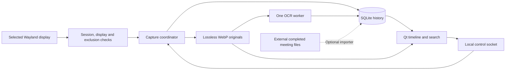

# Architecture

Omarchy Replay stores sampled screen images and makes their visible text searchable. A native Qt viewer reads that history. A separate coordinator owns recording, retention and one OCR worker. An optional importer adds completed transcripts from an installed Omarchy Meeting Recorder. Capture, indexing, storage and search all run locally.

The screen image is the source evidence. OCR helps find it and can contain errors. Replay does not infer which person, conversation or project owns every visible region. App/window metadata used for capture policy is live desktop state, not a complete historical app inventory.

## Processes and data flow

The `omarchy-replay.service` user unit runs `replay daemon run`. A process lease prevents two shared-history coordinators. The recorder and indexer also hold separate archive leases, so a manual CLI command cannot create a second writer of the same kind.

The viewer does not own recording lifetime. Its controls send bounded JSON requests through a private Unix socket. The CLI uses the same control layer. Closing the viewer leaves saved recording intent and indexing choices unchanged.

The coordinator starts one index worker when pending work exists. It keeps the worker warm across nearby captures, then releases it after 15 seconds without work. Worker failure triggers a delayed restart; accepted originals remain on disk.

## Shell plugin and installed runtime

The Omarchy bar widget is a small QML component. A monochrome history mark opens a keyboard-accessible action panel. Loading, disabling or unloading the widget does not start or stop the native coordinator. Setup and recording actions require an explicit action.

Every ten seconds the widget runs a short Python bridge. Its status path reads installation metadata and requests `bar-status` over the existing private coordinator socket. The coordinator returns its existing state without enumerating windows, reading images, querying history or inspecting worker resources. An offline coordinator stays offline. Capture actions use the native control CLI, and opening Settings uses the normal launcher.

The source-built runtime lives in `$XDG_DATA_HOME/omarchy-replay/app/versions/<version>-<content hash>`. Its `bin/replay`, Python helpers, Lua resources, agent guide and license notices are copied from an explicit allowlist. `runtime-manifest.json` records version, source revision/dirty state and SHA-256 hashes plus modes. These hashes detect inconsistent copies; they are not publisher signatures. The `current` pointer and `~/.local/bin/omarchy-replay` launcher select the installed version. Python bytecode caches and source-build fallback are disabled in installed payloads.

Installation stages and verifies the payload before changing integration. Managed-file ownership, conflicts and existing compositor errors are checked first. Updates preserve recording and indexing intent. A failed change restores prior managed files and service state, while reporting concurrent edits that it cannot safely overwrite. Prior payloads remain available for an existing viewer and rollback. [Installation](installation.md) describes removal and the separate shell-plugin lifecycle.

Each open history has one private viewer-control socket and a process lease. Reopening that history or selecting Settings reuses its viewer. This endpoint accepts only `open` and `settings`; it cannot start recording. Its lifetime ends with the viewer and stale endpoints recover on the next launch.

## Capture and source storage

A capture tick checks the compositor, user session, lock/sleep state, selected display and exclusions. Replay checks those conditions again after acquiring the image. A state-generation change invalidates that sample before it enters the archive. Monotonic time schedules captures; wall-clock timestamps identify observations and determine expiration.

The generation comparison uses the fields required by those checks, in stable order. Compositor rendering bookkeeping does not invalidate an otherwise safe sample. Events still protect rapid transitions that begin and end between snapshots. An invalidated capture is discarded; retries back off from 250 ms up to the configured capture interval. A successful capture restores normal scheduling.

The selected display includes a connector and a pinned hardware identity. Replay waits when it disappears or is replaced. After compositor restart, Replay validates the new Wayland socket and exclusion rules before capture resumes. Late ticks do not trigger a burst of catch-up screenshots.

Shared history uses lossless WebP originals at capture resolution. Each accepted image is stored before OCR runs. A consecutive identical image can share its original and frame record while adding another timestamped observation. A capture gap breaks that continuity.

The encoder uses `method=0`, `quality=50`, `exact=1` and one encoding thread. In lossless WebP, quality controls compression effort, not image fidelity. This fast candidate keeps the original pixels and dimensions; the [synthetic effort experiment](webp-effort-experiment.md) records its size, CPU and memory tradeoffs against the previous `quality=0` setting. It affects newly encoded images; existing originals are not recompressed.

This storage mode favors recoverable evidence and immediate image access. Shared recording does not use a long video stream or claim Rewind's historical compression ratios. FFmpeg/video codec paths remain available for finite experiments.

## History model

Each archive has an `index.sqlite` database and its media files. Meeting tables are added when needed:

| Record | Purpose |
| --- | --- |
| `frames` | Image identity, dimensions, location, timestamp bounds, OCR state and text. |
| `observations` | Each retained capture timestamp and its frame reference, including repeated images. |
| `frame_text` | SQLite FTS5 index over recognized text. |
| `frame_ocr_geometry` | Recognized lines and bounding boxes in original-image coordinates. |
| `index_requests`, `index_schedule` | Expiring priority requests and scheduling state. |
| `history_media` | Media publication and retirement for bounded cleanup. |
| `history_gaps` | Known interruptions, such as a paused recorder or coordinator restart. |
| `meeting_records`, `meeting_text` | Imported meeting identity, title, transcript, source link, time confidence and separate FTS5 search. |
| `meeting_tombstones`, `meeting_deleted_ranges`, `meeting_state` | Opaque deletion identities and time boundaries that prevent reimporting removed history. |

A frame can be `pending`, `ready`, `disabled` or `failed`. A pending frame has an original image but no searchable OCR text yet. Coverage distinguishes indexed frames from indexed observations because repeated observations can share one result.

SQLite uses WAL mode and short transactions. Image decode and recognition happen outside the scheduling transaction. Before publishing, OCR checks the frame's identity and current state. A deleted or replaced frame cannot reappear because an older worker finished late. Database contention is retried as contention; it is not labeled an OCR failure.

## OCR and search

The shared worker uses Tesseract data with incremental OCR at original resolution. The configured language set comes from `[indexing] ocr_languages` (Tesseract language names joined by `+`, e.g. `eng+fra`; default `eng`; empty falls back to `eng`). Every configured language's traineddata must be installed, or indexing fails with an error naming the missing model. It compares changes with the previous image, recognizes eligible changed regions and reuses unchanged line results. It falls back to full recognition when reuse is unsuitable. A jump in processing order clears continuity-dependent geometry. The separate exact whole-frame reuse experiment remains opt-in, and its cached results are keyed by the configured language set: changing `ocr_languages` never reuses OCR text produced for another language set.

OCR text and line geometry commit together. Search uses FTS5's `unicode61` tokenizer. The viewer expands the final token after three characters: `contin` can match `continue`, `continuous` and `continuity`. Other supplied terms must also occur. This is prefix matching; it does not correct arbitrary spelling errors or provide semantic search. The current `search` CLI uses whole-token matching.

The viewer pages results chronologically and puts matches on the timeline. Selecting a result loads its original image. Highlights use stored line boxes, scaled with the image. Matching-line copy uses the search tokenizer and includes each line once. Older history without saved geometry can remain searchable but cannot provide those highlights.

An OCR miss is not proof that information never appeared. Small text, unusual layouts and low contrast can reduce recall. Sampling also misses content that appears entirely between capture ticks.

### On-demand selection OCR

Dragging over the saved image maps the preview rectangle back to original-image coordinates, including fit scaling and scroll position. On release, the viewer crops the original pixels and recognizes that area asynchronously. Keyboard selection follows the same path. It works before archive indexing and writes neither OCR text nor geometry back to the archive.

Each viewer runs at most one short-lived Tesseract child for selection OCR. Replacing a selection, navigating away or closing the viewer cancels obsolete work. Before copying, the viewer checks that the result still belongs to the selected image and latest request; a newer clipboard change prevents an older result from overwriting it. Empty, failed and canceled results leave the clipboard intact. These checks are separate from the existing stored-line copy shortcuts.

The crop travels through a bounded memory pipe, without a temporary image file. The child uses one OpenMP thread, nice level 10 and a 10-second wall timeout. Crops are limited to 32 × 1024² pixels and 16,384 pixels per dimension. Recognition follows Omarchy's text-capture settings: a single text block, LSTM recognition, 300 DPI and preserved interword spaces. It uses the installed language data selected by `OMARCHY_OCR_LANGS`, falling back to `eng` when unset or empty. This requested work is separate from the background indexer's CPU allowances and worker ceiling. It runs only after a selection is submitted, with no continuous hover processing.

## Optional meeting import

`meetings.enabled` defaults to `false`. Detection checks for `omarchy-meeting-recorder` on `PATH` without executing it. The optional Settings tab exposes that choice and a source folder; an empty `meetings.directory` uses `~/Documents/Meetings`. Replay consumes completed `.meeting-recorder` manifests and `transcript.md` files. The external recorder owns audio capture, transcription, playback and its original files. Enabling this integration does not start a call recording or screen capture.

One separate importer process runs at nice level 15 while the integration is enabled, the dependency is present and indexing is unpaused. Its archive lease excludes another importer. It visits at most 32 source entries and reads at most 2 MiB of changed text per batch, with a 100 ms pause between continuing batches. Files must retain the same identity, size and timestamps across two passes and be at least one second old. Initial passes run one second apart; a completed reconciliation then sleeps for a minute using a signal-interruptible wait. No audio, images, OCR or speech model is involved.

The importer validates file ownership and types, rejects symlinks and ambiguous manifests, and pins the archive directory/database identity. Config changes, indexing pause, storage loss, explicit deletion and shutdown stop the child before dependent work proceeds. Shutdown has a bounded terminate/kill path, and parent-death signaling plus the installed unit's control-group cleanup prevent an orphan. Source reads and parsing run outside the capture loop. SQLite writes remain short and can contend with the other archive writers.

Meeting text is stored separately from screen OCR. Viewer filters select **All**, **Screen text** or **Meetings**; a meeting appears once, with its matching transcript lines grouped as passages. Transcript rendering is plain text, including untrusted source content. Meeting matches never produce image OCR highlights. The current CLI `search` still returns screen frames only; dedicated agent retrieval remains planned.

A known recorder-supplied start anchors a meeting on the timeline. Imported recordings and absent start times remain searchable without a marker. **Browse screens** requires an observation within ten seconds of a known start and rejects known gaps; it does not imply sentence-level synchronization. Audio pauses, interruptions and uncertain source dates are not reconstructed.

The importer shares the archive's age, disk allowance and free-space reserve. It checks space before publication and can defer imports while bounded cleanup makes room. Additional implementation limits are 512 KiB per transcript, 64 KiB per manifest, 5,000 meetings and 64 MiB of source text. These limits and low priority do not constitute a CPU quota: the OCR pacing settings and OCR worker ceiling do not govern this process. Include its CPU, memory and I/O when measuring Replay's total cost. See the [meeting guide](meetings.md) for source updates, controls and limits.

## CPU scheduling

Capture and OCR have different costs. Capture acquires, hashes and compresses pixels. OCR decodes originals, plans changes and recognizes text. A lower OCR allowance delays that work; it does not remove its total CPU cost.

Shared recording uses these defaults, expressed as a percentage of **one CPU core**:

| Condition | OCR allowance |
| --- | --- |
| User active | 40% |
| User idle for 60 seconds | 50% |
| Requested moment or temporary catch-up | At least 50%, or the applicable active/idle allowance if higher |
| Sustained CPU contention | 10%, taking precedence over requested work |
| Activity/pressure signals unavailable | Active allowance; unknown is not treated as idle |

The scheduler combines compositor idle notifications, Linux CPU pressure stall information and aggregate CPU utilization. Pressure alone can rise when a background job is quota-throttled despite spare cores. Replay enters pressure mode after at least 5% pressure and 85% utilization persist for 3 seconds. It requires 5 seconds of recovery with utilization at or below 70%, or sufficiently lower pressure, before releasing that mode.

`WorkBudget` compares process CPU time with elapsed time at OCR checkpoints and inserts short sleeps when work exceeds the allowance. Tesseract must reach a checkpoint to respond. This cooperative pacing does not cap every decode, allocation or compression operation.

A separate limit requests a **60% whole-worker ceiling** through a managed systemd user service and cgroup v2. Replay verifies worker membership and effective limits, then reports enforcement separately from the requested setting. If that facility is unavailable, cooperative pacing and low process priority remain active; the UI reports the ceiling as unavailable. This ceiling covers the OCR worker, not the capture coordinator, viewer or optional meeting importer.

The scripts limit OpenMP to one thread. Worker lifecycle monitoring prevents an orphaned managed worker from continuing after its controller exits. Low scheduling and I/O priority reduce competition but do not establish a foreground latency guarantee.

## Backlog and throughput

The OCR backlog is durable work against archived images, not an in-memory queue of screen buffers. Shared recording has no pending-image count cutoff that discards captures. Admission depends on disk capacity and the free-space reserve.

A selected moment and its neighbors can receive priority. After at most three priority selections, the worker selects the oldest pending frame. Temporary catch-up raises the applicable allowance for a bounded period. Both mechanisms preserve progress on older work.

If changed images arrive faster than OCR processes them, the backlog grows. It clears only when processing capacity exceeds incoming work for long enough, indexing remains enabled and originals remain retained. A pending moment can expire before it is processed. Search coverage therefore matters even when original images are available.

Hardware and workload change that balance. A 4K display, dense small text, frequent full-screen changes and a slower CPU can require more work than a mostly static lower-resolution display. Tune from throughput, oldest pending age and user responsiveness. CPU model or core count alone does not determine the right allowance.

## Retention and disk limits

Three independent controls govern storage:

1. `retention_days` expires observations older than the moving age window.
2. `max_disk_mib` limits the selected archive's disk use.
3. `min_free_mib` reserves free space on that filesystem.

Shared recording uses a rolling storage allowance. Before admitting a new original, the recorder can reclaim the oldest observations and unreferenced media to make room. The retained interval is bounded by both maximum age and available storage; a full allowance does not permanently stop recording. Cleanup is bounded, and capture can wait between batches or when sufficient space cannot be reclaimed safely. Finite trial archives retain their original stop-at-limit behavior.

Maintenance deletes bounded batches of observations, then unreferenced frames and media. Repeated-image references keep an original alive until its last retained observation expires. SQLite reclamation is incremental. Normal maintenance runs every 10 seconds, with further batches scheduled sooner while cleanup remains.

Older prototype databases without incremental vacuum cannot shrink their index in place. If that index alone exceeds a reduced allowance, Replay preserves the remaining history and reports that separate compaction or a larger allowance is needed. New shared histories support bounded index reclamation.

Recent-history deletion stops interfering work, records its interval durably and completes bounded cleanup. Settings reviews shorter retention, a smaller allowance or a larger free-space reserve; recent deletion requires separate confirmation. Direct TOML edits are operational: lowering retention applies the shorter window when the coordinator accepts it. Replay does not promise forensic erasure from backups, filesystem snapshots or underlying storage.

Meeting expiration and interval deletion use the known meeting start, or first import time when its date is unknown. Deletion removes the whole indexed meeting; a meeting starting before the requested interval remains even if the call continued into it. Opaque tombstones and deletion ranges survive rescans, including an interval deleted before the first import. Disabling integration preserves cached meetings until retention or deletion removes them. Removing a source meeting is reconciled after a complete readable scan; an unavailable root does not erase cached transcripts. Replay never modifies the external recording or transcript.

## Storage location and configuration

The canonical product directory is `omarchy-replay`:

| Data | Default |
| --- | --- |
| TOML settings | `~/.config/omarchy-replay/config.toml` |
| Shared archive | `~/.local/share/omarchy-replay/history` |
| Intent, accepted settings and logs | `~/.local/state/omarchy-replay` |
| Cache | `~/.cache/omarchy-replay` |
| Control socket and leases | `$XDG_RUNTIME_DIR/omarchy-replay` |

Absolute XDG overrides are supported. A private per-user temporary runtime directory is used when `XDG_RUNTIME_DIR` is absent. `daemon paths`, run with the installed executable, reports the resolved locations. Settings’ copied agent prompts include that executable path, these directories, the supported TOML reference and remote source links; they require no local repository checkout.

`storage.directory` selects an existing local folder owned by the user. Empty means the default location. A custom folder must be empty or compatible Replay history; a folder that is itself a symbolic link is rejected, and network filesystems are unsupported. Switching archives preserves the old folder and does not combine histories. Retention applies only to the selected archive. A private identity marker checks that the folder is the registered archive. A missing folder or mismatched marker blocks archive access until the expected storage returns. There is no fallback to the main disk.

`replay_config.cpp` parses TOML with strict types and ranges. Native settings writes are atomic, preserve unknown values and reject conflicting edits. Accepted settings are copied privately to `last-valid-config.toml`. A malformed edit leaves the live configuration unchanged; a restart can use the last accepted copy and report the error. Reload on a running coordinator preserves capture intent. Offline reload starts a coordinator with capture held and can change saved running intent to paused; agents should use read-only `daemon paths` validation and leave it offline unless asked to start it. Path resolution can use the last valid config, so callers must inspect `config_error` and `using_last_valid_config` as well as the process exit status.

## Desktop lifecycle and exclusions

The coordinator stores capture intent as `running`, `paused` or `stopped`. Current capture can still be blocked by a lock, inactive session, sleep, missing display, storage failure or exclusion. Clearing a block permits capture only if intent is running. Wake and unlock do not override a manual pause or stop.

Login startup controls whether systemd starts the coordinator with saved intent. Stopping recording leaves indexing and retention available. Shutting down the coordinator ends those processes too.

Replay's own window and Omarchy's screensaver (`org.omarchy.screensaver`) have mandatory compositor masking, independent of the configured app list. The screensaver also pauses capture while potentially visible on the selected output. Closing it clears that exclusion without changing saved intent; capture still requires an active, unlocked session and the other environment checks. OCR can continue while awake. Configured privacy apps (`apps`), recording-only apps (`skip_apps`) and window rules pause capture under the same visibility rule. Only privacy apps and window rules install compositor `no_screen_share` masks, which protect pixels during transitions and window animations. Recording-only skips use the existing pre/post checks and discard images when window state changes during capture. They reduce unwanted history; they do not guarantee secrecy for animation tails or unlisted popups. Replay verifies a token for the accepted, loaded rules before native capture. Failed installation or unverified state blocks capture.

Fresh privacy defaults cover known password managers, authenticators and key stores. Steam is a recording-only default. The [preset inventory](exclusion-presets.md) records exact identities and sources. Matchers use exact current or initial local app identities; content inside a meeting video is not a separate local app. A Google Meet or Zoom window can therefore retain an incoming screen share at the configured interval.

Explicit `exclusions.apps` and `exclusions.skip_apps` arrays replace their respective defaults. For backward compatibility, an existing explicit `apps` array with no `skip_apps` gets no implicit skips; old masks stay protected. Saves write both arrays. If an ID is in both, its privacy mask still applies. Settings merges presets into the appropriate editor, checks a combined limit of 64 entries and writes only on Save. It does not silently remove old masks when adding a skip preset. Source defaults and the copied agent reference share `src/exclusion_presets.h`; the compositor installer carries the same fallback lists and checks the same limit.

The installer includes both lists in its verified policy token but emits masks only for privacy apps and window rules. Moving an app from `apps` to `skip_apps` changes the managed rule file and reloads Hyprland, removing its old mask. Unrelated compositor rules remain in place. A policy whose mask installation cannot be verified still blocks capture. Startup and accepted config reloads schedule mask reconciliation even with paused/stopped recording. Retries back off to at most once per minute; after success, paused recording adds no reconciliation polling. Status exposes pending/error state. The helper receipt must still match the accepted config after any concurrent reload, so an obsolete receipt cannot authorize capture.
Privacy rules also affect other screen-sharing tools that honor them, even while Replay is stopped. Window rules combine nonempty fields with AND; different rules are alternatives. A window address is valid only in its recorded compositor instance and requires an app or title guard. Its compositor mask uses that broader app/title match, so it can hide other matching windows too.

Exclusions affect future capture; they do not remove earlier images. Additional apps or alternate builds need their actual window identifiers.

## Controls and recovery

The private socket accepts one bounded request per connection. The client does not retry a mutation after an ambiguous sent request. Offline pause, stop and shutdown update durable intent under the coordinator lease without launching capture. Other offline controls can start the coordinator with capture held; only start/resume explicitly permit capture.

Pending OCR survives process exit. Startup recovers incomplete media publication and cleanup work. An interrupted OCR pass stays pending; a genuine recognition/source error becomes failed. Retrying failed content is separate from restarting a failed worker. Legacy trial archives retain their own policies and remain separate from shared history.

Status includes capture intent and block reason, indexing coverage, oldest pending age, archive usage and worker policy/enforcement. Coordinator logs are bounded. Error logs and status can contain local paths or window information and remain private diagnostics.

The normal status response also includes `meetings`: dependency availability, enabled/paused state, source folder, worker state, last reported count, sync counters, a `limited` flag and an error. These are cached importer diagnostics with no transcript text. They do not add source scans to `bar-status` polling. Counts describe the last scan and can be stale after integration is disabled. A limited import can indicate storage pressure or an implementation bound; raising OCR CPU settings does not resolve either condition.

Storage forecasts read at most 2,001 recent observations from the last 24 hours once per minute, using existing numeric metadata. The estimate credits bounded capture intervals, rather than time spent locked or paused, and counts each new original once. It reports the active recording hours that the effective rolling allowance can hold, after five minutes of sampled activity. With at least seven retained calendar days, existing archive size and time bounds also support a rough daily-growth estimate, projected capacity in days, and space for the selected age window. Settings reuses these rates when the user changes size, reserve or age. Changing capture settings or the archive saves one sampling boundary with the existing coordinator state; rates then use only later observations, including after restart. Calendar projections wait until older observations have left the archive, so their bytes are not attributed to the new settings. Estimates do not guarantee future workload or database growth. No resource-history series is recorded.

Capture diagnostics are opt-in: `daemon debug --seconds 30` enables bounded in-memory counters on an already running coordinator, then disables them. The range is 1–300 seconds, with a server-side expiry even if the client exits. Output contains fixed field/event names and counts, never metadata values, images or OCR. Offline debugging does not start the service or change recording intent. CPU, memory and power measurements remain explicit diagnostic work.

## Verification and limits

Synthetic histories test storage, search, scheduling, deletion and lifecycle behavior. Native masking checks use an isolated headless compositor with fictional screens. The [implementation record](background-recording-implementation.md) documents the previous milestone's checks and idle measurements; it is a dated result, not an all-day guarantee.

The opt-in [exclusion scope check](../scripts/exclusion_scope_check.py) verifies ordinary screenshot pixels before and after changing privacy masks, preservation of sensitive/self masks, and policy updates while the coordinator is stopped or paused. Run it after building with `python3 scripts/exclusion_scope_check.py --dir runs/exclusion-scope-check-new`, using a fresh output directory. It requires Hyprland, mpv, grim and FFmpeg and owns an isolated compositor and synthetic windows. Meeting-window checks use synthetic app identities; they do not establish behavior in an actual Meet or Zoom call.

Performance comparisons must report retained observations, indexed coverage, oldest pending age, CPU, memory, disk growth and foreground impact together. Count the coordinator, OCR worker, managed child and optional importer when measuring process cost. Distinguish OCR CPU time from elapsed time that includes pacing. Compare the same images and recognition results when evaluating an optimization.

Current limits include one selected display, local storage, imperfect OCR and sampling gaps. S3-compatible offload, cross-device access, semantic retrieval and a dedicated agent context interface remain roadmap work. Existing CLI search/extraction can supply evidence to a coding agent, but Replay does not execute that agent's tasks.

## Source map

| File | Responsibility |
| --- | --- |
| `src/recording_service.cpp` | Coordinator, intent, capture loop, worker and maintenance. |
| `src/recording_control.cpp` | Socket client, offline controls and startup handoff. |
| `src/recording_environment.cpp` | Compositor/session/display/exclusion checks. |
| `src/capture.cpp` | Native Wayland image acquisition. |
| `src/recorder.cpp` | Archives, OCR, SQLite search and history cleanup. |
| `src/meeting_index.cpp` | Bounded external transcript import, separate search and deletion/retention integration. |
| `src/meeting_view.cpp` | Plain-text transcript display, passage navigation and original-recording links. |
| `src/index_scheduler.cpp`, `src/work_budget.cpp` | Adaptive policy and cooperative pacing. |
| `src/index_resources.cpp` | Managed worker lifecycle and verified limits. |
| `src/replay_config.cpp` | Paths, TOML validation and atomic settings writes. |
| `src/viewer.cpp` | Search, timeline, image selection, clipboard ownership, controls and settings. |
| `src/selection_ocr.cpp` | Bounded, cancelable OCR of an in-memory image crop. |
| `src/agent_prompt.cpp` | Self-contained agent prompts for the installed app. |
| `scripts/install_recording_service.py` | Local service, launcher and shortcut installation. |
| `scripts/install_capture_exclusions.py` | Managed compositor capture masks. |
